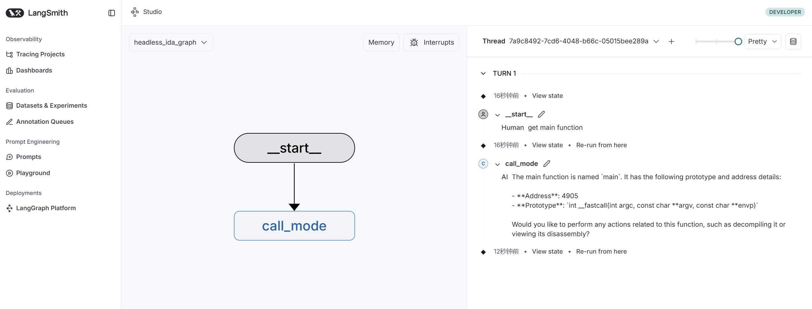

# Acknowledgments

This project builds upon the work of:

- Tools code adapted from [ida-pro-mcp](https://github.com/mrexodia/ida-pro-mcp) by mrexodia
- Utilizes the [headless-ida](https://github.com/DennyDai/headless-ida) library by DennyDai

# Headless IDA MCP Server

Headless IDA MCP Server is a headless server project based on IDA Pro, designed to provide remote analysis and management capabilities through the Multi-Client Protocol (MCP).

## Project Description

This project uses IDA Pro's headless mode to analyze binary files and provides a suite of tools via MCP to manage and manipulate functions, variables, and more.

## Prerequisites

- Python 3.12 or higher
- IDA Pro with headless support (idat) https://github.com/DennyDai/headless-ida

## Installation

1. Clone the project locally:

   ```bash
   git clone https://github.com/cnitlrt/headless-ida-mcp-server.git 
   cd headless-ida-mcp-server
   ```
2. Install dependencies:

   ```bash
   uv python install 3.12
   uv venv --python 3.12
   source .venv/bin/activate
   uv pip install -e .
   ```

## Configuration

1. Copy the example environment file:

   ```bash
   cp .env_example .env
   ```
2. Configure the following environment variables in `.env`:

   - `IDA_PATH`: Path to IDA Pro's headless executable (idat), e.g., `/home/ubuntu/idapro/idat`
   - `BINARY_PATH`: Path to the binary file for analysis, e.g., `./test/main`
   - `PORT`: Port number for the MCP server, e.g., `8888`
   - `HOST`: Host address for the MCP server, e.g., `127.0.0.1`
   - `TRANSPORT`: MCP transport mode (`sse` or `stdio`)
   - `OPENAI_API_KEY`: OPENAI_API_KEY

## Usage

1. Start the server:

   ```bash
   uv run langgraph dev --port 2044
   ```
